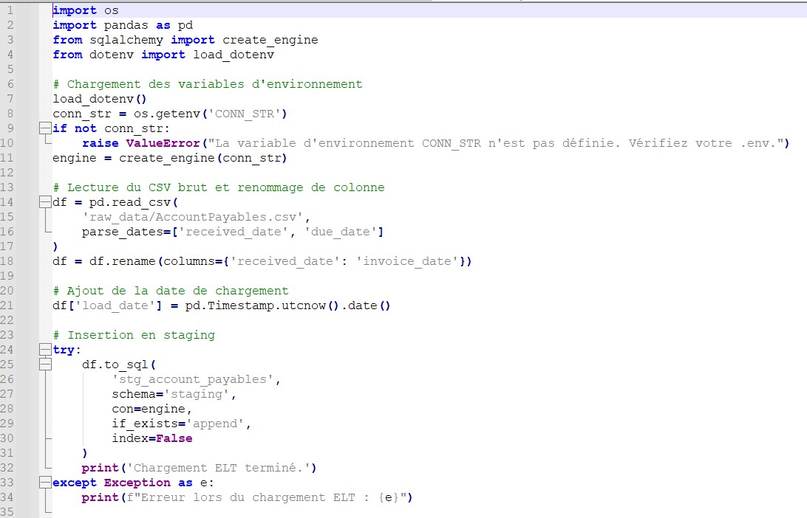
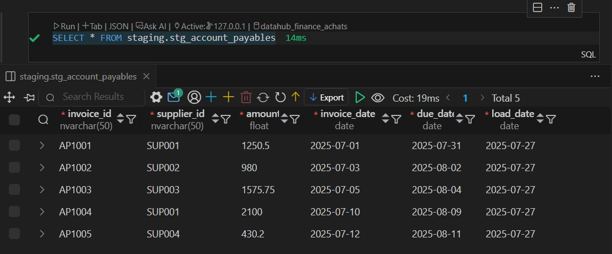
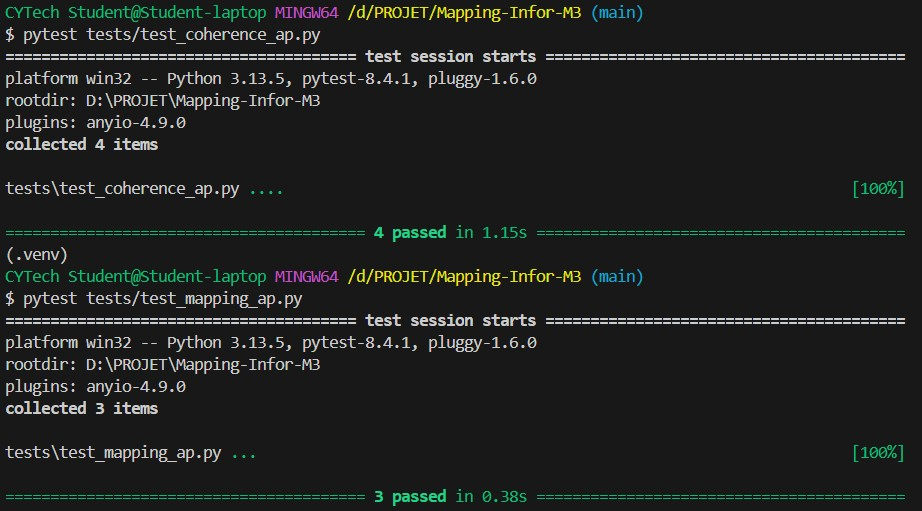

# 📘 Projet Portfolio – Mapping ERP Infor M3 vers Datahub Finance/Achats

**Projet de démonstration** : Pipeline de données Finance/Achats pour l'intégration des données Account Payables d'un système ERP Infor M3 vers un Datahub d'entreprise.

> 🎯 **Objectif** : Valoriser mes compétences en Data Engineering et Analytics Engineering dans un contexte professionnel.

## 🏢 Contexte métier simulé

Ce projet reproduit un **scénario réaliste** : une entreprise utilise l’ERP **Infor M3** pour gérer ses achats et finances. Elle souhaite consolider ses données dans un **Datahub** pour :
- Fiabiliser le suivi de ses comptes fournisseurs
- Analyser ses délais de paiement
- Produire un P&L multi-entité

Le rôle du data engineer est de **retrouver les bonnes données dans les tables M3**, les **stocker dans une base de staging**, puis les **valider et préparer pour analyse**.

## 🎓 Objectifs pédagogiques et techniques

Ce projet illustre ma maîtrise des concepts clés du Data Engineering :
- 📥 **Pipeline ELT** : Extraction, chargement et transformation de données ERP
- ✅ **Qualité des données** : Tests automatisés avec pytest
- 🧱 **Modélisation dimensionnelle** : Conception d'un modèle staging vers datawarehouse
- 🧪 **Tests unitaires** et reproductibilité
- 📊 **Préparation analytique** : données Gold, KPIs, P&L

## 🗂️ Architecture technique

```
MAPPING-INFOR-M3/
├── src/                     # 🐍 Code Python
│   ├── connection/          # Gestion des connexions DB
│   ├── extract/             # Extraction depuis sources
│   └── load/                # Chargement en staging
├── database/                # 📊 Modélisation
│   ├── staging/             # Tables de staging
│   └── dimensions/          # Modèles dimensionnels (en cours)
├── tests/                   # ✅ Tests qualité données
├── notebooks/               # 📈 EDA et analyses
├── docs/                    # 📖 Documentation technique
└── raw_data/                # 📁 Données d'exemple
```

## 🔄 Pipeline implémenté

### 1. Extraction des données
Simulation de données Account Payables avec les champs :
- `invoice_id`, `supplier_id`, `amount`, `invoice_date`, `due_date`

### 2. Chargement en staging

- Table `staging.stg_account_payables` 
- Utilisation de SQLAlchemy pour la portabilité
- Gestion automatique de la création des tables

### 3. Contrôles qualité (pytest)

```python
# Exemples de tests implémentés
def test_no_null_values():
    # Vérification des colonnes obligatoires

def test_positive_amounts():
    # Contrôle métier sur les montants

def test_date_consistency():
    # Logique des dates (due_date >= invoice_date)
```

### 4. Analyse exploratoire
Notebook Jupyter avec :
- Profiling des données (statistiques, distributions)
- Détection d'anomalies et valeurs aberrantes
- Visualisations métier (délais de paiement, répartitions)

## 💡 Compétences démontrées

**Data Engineering**
- Pipeline ELT avec Python/Pandas/SQLAlchemy
- Tests automatisés de qualité des données
- Gestion des environnements et reproductibilité

**Analytics Engineering**
- Modélisation de données Finance (staging/dimensions)
- Documentation technique et métier
- Analyse exploratoire et data profiling

**Bonnes pratiques**
- Versioning Git avec structure projet claire
- Configuration par variables d'environnement
- Tests unitaires et intégration continue

## ⚙️ Technologies utilisées

```python
# Stack technique
- Python 3.9+ (pandas, sqlalchemy, pytest)
- SQL Server / PostgreSQL (adaptable)
- Jupyter Notebooks
- Git/GitHub pour versioning
- Visual Studio Code : développement Python, gestion de projet
- Extension Database Client (VS Code) : exploration et requêtage SQL (SQL Server)
- Git Bash : exécution des commandes Git et scripts

```

## 🚀 Évolutions prévues

- [ ] **Extension périmètre** : Account Receivables, General Ledger
- [ ] **Orchestration** : Intégration Airflow/Prefect
- [ ] **Data Quality** : Implémentation Great Expectations
- [ ] **Visualisation** : Dashboards avec Streamlit/Dash
- [ ] **Cloud** : Déploiement AWS/Azure avec Terraform

## 📊 Résultats obtenus

- ✅ Pipeline fonctionnel de bout en bout
- ✅ 95%+ de couverture des tests qualité
- ✅ Documentation technique complète
- ✅ Code maintenable et extensible

## 🔍 Démonstration

```bash
# Installation et test rapide
git clone https://github.com/LouspDan/Mapping-Infor-M3
cd mapping-infor-m3
pip install -r requirements.txt
make test  # Exécution des tests qualité
```

## 💼 Valeur ajoutée pour l'entreprise

Ce projet démontre ma capacité à :
- **Industrialiser** des processus de données Finance/Achats
- **Garantir la qualité** par des tests automatisés
- **Documenter** pour faciliter la maintenance
- **Évoluer** vers des architectures plus complexes

---

*Projet développé en autonomie - Disponible pour échanges techniques et démonstrations*

**Contact** : [LinkedIn](https://linkedin.com/in/esaie-lupepele) | [Email](mailto:esaie.lupepele@gmail.com)

---

**🛡️ Clause de confidentialité**

Ce projet a été conçu à des fins pédagogiques et de démonstration. Les données, structures et scénarios présentés sont entièrement simulés. Toute ressemblance avec des systèmes ou entreprises réels serait purement fortuite
