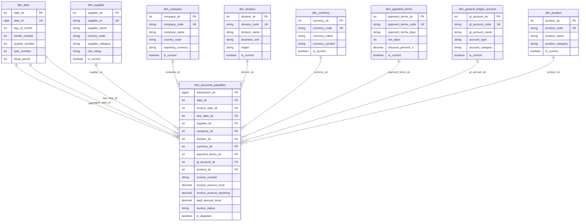

# 📊 Modèle Dimensionnel - Accounts Payables (AP)

## 1. Dimensions identifiées

### 🗓️ **dim_date**
```sql
CREATE TABLE dim_date (
    date_sk             INTEGER PRIMARY KEY,  -- Surrogate Key
    date_id             DATE UNIQUE,          -- Business Key (YYYY-MM-DD)
    day_of_month        INTEGER,
    day_of_week         INTEGER,
    day_name            VARCHAR(20),
    week_of_year        INTEGER,
    month_number        INTEGER,
    month_name          VARCHAR(20),
    quarter_number      INTEGER,
    quarter_name        VARCHAR(10),          -- Q1, Q2, Q3, Q4
    year_number         INTEGER,
    fiscal_year         INTEGER,
    fiscal_period       INTEGER,
    is_weekend          BOOLEAN,
    is_holiday          BOOLEAN,
    created_at          TIMESTAMP,
    updated_at          TIMESTAMP
);
```

### 🏢 **dim_supplier**
```sql
CREATE TABLE dim_supplier (
    supplier_sk         INTEGER PRIMARY KEY,  -- Surrogate Key
    supplier_id         VARCHAR(20),          -- Business Key (M3: SINO)
    supplier_name       VARCHAR(200),
    supplier_status     VARCHAR(20),          -- Active, Inactive, Blocked
    address_line1       VARCHAR(100),
    address_line2       VARCHAR(100),
    city                VARCHAR(50),
    state_province      VARCHAR(50),
    postal_code         VARCHAR(20),
    country_code        VARCHAR(3),
    country_name        VARCHAR(50),
    phone_number        VARCHAR(30),
    email               VARCHAR(100),
    tax_id              VARCHAR(50),
    supplier_category   VARCHAR(50),          -- Strategic, Preferred, Standard
    payment_terms_code  VARCHAR(10),
    currency_code       VARCHAR(3),
    credit_limit        DECIMAL(15,2),
    risk_rating         VARCHAR(10),          -- Low, Medium, High
    created_date        DATE,
    effective_date      DATE,
    expiry_date         DATE,
    is_current          BOOLEAN,
    created_at          TIMESTAMP,
    updated_at          TIMESTAMP
);
```

### 💰 **dim_currency**
```sql
CREATE TABLE dim_currency (
    currency_sk         INTEGER PRIMARY KEY,  -- Surrogate Key
    currency_code       VARCHAR(3),           -- Business Key (EUR, USD, GBP)
    currency_name       VARCHAR(50),
    currency_symbol     VARCHAR(5),
    decimal_places      INTEGER,
    is_base_currency    BOOLEAN,
    country_code        VARCHAR(3),
    effective_date      DATE,
    expiry_date         DATE,
    is_current          BOOLEAN,
    created_at          TIMESTAMP,
    updated_at          TIMESTAMP
);
```

### 🏭 **dim_division**
```sql
CREATE TABLE dim_division (
    division_sk         INTEGER PRIMARY KEY,  -- Surrogate Key
    division_code       VARCHAR(10),          -- Business Key (M3: DIVI)
    division_name       VARCHAR(100),
    division_type       VARCHAR(50),          -- Manufacturing, Sales, Service
    business_unit       VARCHAR(50),
    region              VARCHAR(50),
    country_code        VARCHAR(3),
    manager_name        VARCHAR(100),
    cost_center         VARCHAR(20),
    profit_center       VARCHAR(20),
    is_active           BOOLEAN,
    created_date        DATE,
    effective_date      DATE,
    expiry_date         DATE,
    is_current          BOOLEAN,
    created_at          TIMESTAMP,
    updated_at          TIMESTAMP
);
```

### 🌍 **dim_company**
```sql
CREATE TABLE dim_company (
    company_sk          INTEGER PRIMARY KEY,  -- Surrogate Key
    company_code        VARCHAR(10),          -- Business Key (M3: CONO)
    company_name        VARCHAR(200),
    legal_entity_name   VARCHAR(200),
    company_type        VARCHAR(50),          -- Subsidiary, Branch, Headquarters
    tax_id              VARCHAR(50),
    registration_number VARCHAR(50),
    address_line1       VARCHAR(100),
    address_line2       VARCHAR(100),
    city                VARCHAR(50),
    state_province      VARCHAR(50),
    postal_code         VARCHAR(20),
    country_code        VARCHAR(3),
    country_name        VARCHAR(50),
    reporting_currency  VARCHAR(3),
    functional_currency VARCHAR(3),
    fiscal_year_end     VARCHAR(5),           -- MM-DD
    consolidation_code  VARCHAR(10),
    parent_company_sk   INTEGER,              -- Self-referencing FK
    is_active           BOOLEAN,
    created_date        DATE,
    effective_date      DATE,
    expiry_date         DATE,
    is_current          BOOLEAN,
    created_at          TIMESTAMP,
    updated_at          TIMESTAMP
);
```

### 💳 **dim_payment_terms**
```sql
CREATE TABLE dim_payment_terms (
    payment_terms_sk    INTEGER PRIMARY KEY,  -- Surrogate Key
    payment_terms_code  VARCHAR(10),          -- Business Key (M3: TEPY)
    payment_terms_desc  VARCHAR(100),
    payment_method      VARCHAR(50),          -- Check, Wire, ACH, Credit Card
    net_days            INTEGER,              -- Net payment days
    discount_days_1     INTEGER,              -- Early payment discount days
    discount_percent_1  DECIMAL(5,2),         -- Early payment discount %
    discount_days_2     INTEGER,
    discount_percent_2  DECIMAL(5,2),
    late_fee_percent    DECIMAL(5,2),
    is_active           BOOLEAN,
    created_date        DATE,
    effective_date      DATE,
    expiry_date         DATE,
    is_current          BOOLEAN,
    created_at          TIMESTAMP,
    updated_at          TIMESTAMP
);
```

### 📚 **dim_general_ledger_account**
```sql
CREATE TABLE dim_general_ledger_account (
    gl_account_sk       INTEGER PRIMARY KEY,  -- Surrogate Key
    gl_account_code     VARCHAR(20),          -- Business Key (M3: AIT)
    gl_account_name     VARCHAR(200),
    gl_account_desc     VARCHAR(500),
    account_type        VARCHAR(50),          -- Asset, Liability, Expense, Revenue
    account_subtype     VARCHAR(50),          -- Current Asset, Fixed Asset, etc.
    account_category    VARCHAR(50),          -- Operating, Non-operating
    parent_account_sk   INTEGER,              -- Hierarchy support
    account_level       INTEGER,              -- 1=Summary, 2=Detail, etc.
    normal_balance      VARCHAR(10),          -- Debit, Credit
    is_active           BOOLEAN,
    is_summary_account  BOOLEAN,
    allows_posting      BOOLEAN,
    department_code     VARCHAR(20),
    cost_center_code    VARCHAR(20),
    profit_center_code  VARCHAR(20),
    created_date        DATE,
    effective_date      DATE,
    expiry_date         DATE,
    is_current          BOOLEAN,
    created_at          TIMESTAMP,
    updated_at          TIMESTAMP
);
```

### 📦 **dim_product** (optionnelle)
```sql
CREATE TABLE dim_product (
    product_sk          INTEGER PRIMARY KEY,  -- Surrogate Key
    product_code        VARCHAR(50),          -- Business Key (M3: ITNO)
    product_name        VARCHAR(200),
    product_description VARCHAR(500),
    product_category    VARCHAR(100),
    product_subcategory VARCHAR(100),
    product_family      VARCHAR(100),
    brand               VARCHAR(100),
    manufacturer        VARCHAR(100),
    unit_of_measure     VARCHAR(10),
    weight_kg           DECIMAL(10,3),
    is_active           BOOLEAN,
    created_date        DATE,
    effective_date      DATE,
    expiry_date         DATE,
    is_current          BOOLEAN,
    created_at          TIMESTAMP,
    updated_at          TIMESTAMP
);
```

## 2. Table de faits - fact_accounts_payables

```sql
CREATE TABLE fact_accounts_payables (
    -- Surrogate Keys (Foreign Keys vers dimensions)
    transaction_sk          BIGINT PRIMARY KEY,
    date_sk                 INTEGER NOT NULL,
    invoice_date_sk         INTEGER NOT NULL,
    due_date_sk             INTEGER NOT NULL,
    supplier_sk             INTEGER NOT NULL,
    company_sk              INTEGER NOT NULL,
    division_sk             INTEGER NOT NULL,
    currency_sk             INTEGER NOT NULL,
    payment_terms_sk        INTEGER NOT NULL,
    gl_account_sk           INTEGER NOT NULL,
    product_sk              INTEGER,             -- Nullable
    
    -- Business Keys (Degenerate Dimensions)
    invoice_number          VARCHAR(50) NOT NULL,
    invoice_line_number     INTEGER,
    purchase_order_number   VARCHAR(50),
    po_line_number          INTEGER,
    receipt_number          VARCHAR(50),
    voucher_number          VARCHAR(50),
    
    -- Mesures (Metrics)
    invoice_amount_local    DECIMAL(15,2),       -- Devise locale
    invoice_amount_reporting DECIMAL(15,2),      -- Devise de reporting
    tax_amount_local        DECIMAL(15,2),
    tax_amount_reporting    DECIMAL(15,2),
    discount_amount_local   DECIMAL(15,2),
    discount_amount_reporting DECIMAL(15,2),
    paid_amount_local       DECIMAL(15,2),
    paid_amount_reporting   DECIMAL(15,2),
    exchange_rate           DECIMAL(10,6),
    quantity                DECIMAL(15,3),
    unit_price_local        DECIMAL(15,4),
    
    -- Attributs descriptifs (Mini-dimensions)
    invoice_status          VARCHAR(20),         -- Draft, Approved, Paid, Cancelled
    approval_status         VARCHAR(20),         -- Pending, Approved, Rejected
    payment_status          VARCHAR(20),         -- Unpaid, Partially Paid, Paid
    matching_status         VARCHAR(20),         -- Matched, Unmatched, Exception
    
    -- Indicateurs booléens
    is_disputed             BOOLEAN DEFAULT FALSE,
    is_recurring            BOOLEAN DEFAULT FALSE,
    is_manual               BOOLEAN DEFAULT FALSE,
    has_early_payment_discount BOOLEAN DEFAULT FALSE,
    
    -- Dates importantes (dénormalisées pour performance)
    invoice_date            DATE,
    due_date                DATE,
    payment_date            DATE,
    approval_date           DATE,
    goods_receipt_date      DATE,
    
    -- Métadonnées techniques
    source_system           VARCHAR(20) DEFAULT 'M3',
    batch_id                VARCHAR(50),
    created_at              TIMESTAMP,
    updated_at              TIMESTAMP,
    
    -- Contraintes
    CONSTRAINT fk_fact_ap_date FOREIGN KEY (date_sk) REFERENCES dim_date(date_sk),
    CONSTRAINT fk_fact_ap_supplier FOREIGN KEY (supplier_sk) REFERENCES dim_supplier(supplier_sk),
    CONSTRAINT fk_fact_ap_company FOREIGN KEY (company_sk) REFERENCES dim_company(company_sk),
    CONSTRAINT fk_fact_ap_division FOREIGN KEY (division_sk) REFERENCES dim_division(division_sk),
    CONSTRAINT fk_fact_ap_currency FOREIGN KEY (currency_sk) REFERENCES dim_currency(currency_sk),
    CONSTRAINT fk_fact_ap_payment_terms FOREIGN KEY (payment_terms_sk) REFERENCES dim_payment_terms(payment_terms_sk),
    CONSTRAINT fk_fact_ap_gl_account FOREIGN KEY (gl_account_sk) REFERENCES dim_general_ledger_account(gl_account_sk),
    CONSTRAINT fk_fact_ap_product FOREIGN KEY (product_sk) REFERENCES dim_product(product_sk)
);
```

## 3. Clés et relations

### **Clés Surrogate (SK)**
- **Avantages** : 
  - Performance optimale (entiers vs chaînes)
  - Gestion des changements SCD Type 2
  - Indépendance des clés métier
  - Uniformité entre dimensions

- **Convention de nommage** : `[table]_sk`
- **Type** : INTEGER AUTO_INCREMENT
- **Index** : PRIMARY KEY clustered

### **Clés métier (Business Keys)**
- Conservées pour audit et debugging
- Index UNIQUE pour intégrité
- Utilisées dans les ETL pour lookup

### **Clés dégénérées (Degenerate Dimensions)**
- Stockées directement dans la fact table
- Numéros de transaction, références documents
- Pas de dimension séparée (trop granulaire)

## 4. Diagramme ERD - Schéma en étoile



## 5. Index et optimisations

### **Index sur fact_accounts_payables**
```sql
-- Index de performance principaux
CREATE INDEX idx_fact_ap_date ON fact_accounts_payables(date_sk);
CREATE INDEX idx_fact_ap_supplier ON fact_accounts_payables(supplier_sk);
CREATE INDEX idx_fact_ap_company_division ON fact_accounts_payables(company_sk, division_sk);
CREATE INDEX idx_fact_ap_status ON fact_accounts_payables(invoice_status, payment_status);
CREATE INDEX idx_fact_ap_amounts ON fact_accounts_payables(invoice_amount_reporting) WHERE invoice_amount_reporting > 0;

-- Index composite pour requêtes fréquentes
CREATE INDEX idx_fact_ap_reporting ON fact_accounts_payables(company_sk, date_sk, currency_sk);
CREATE INDEX idx_fact_ap_supplier_analysis ON fact_accounts_payables(supplier_sk, date_sk, invoice_status);
```

### **Partitioning (selon SGBD)**
```sql
-- Partitioning par date (mensuel)
ALTER TABLE fact_accounts_payables 
PARTITION BY RANGE (date_sk) (
    PARTITION p_2023_01 VALUES LESS THAN (20230201),
    PARTITION p_2023_02 VALUES LESS THAN (20230301),
    -- etc.
);
```

## 6. Métriques et KPI calculables

### **Métriques de base**
- **Total AP Outstanding** : `SUM(invoice_amount_reporting - paid_amount_reporting)`
- **Average Payment Days** : `AVG(payment_date - invoice_date)`
- **Days Payable Outstanding (DPO)** : `(AP Outstanding / Daily Purchases) * Days`

### **Analyses par dimension**
- **By Supplier** : concentration, performance, risques
- **By Division** : consommation, budgets, variances  
- **By GL Account** : répartition par nature de dépense
- **By Time** : tendances, saisonnalité, prévisions

### **Indicateurs qualité**
- **On-time Payment Rate** : `% factures payées avant due_date`
- **Dispute Rate** : `% factures disputées`
- **Matching Efficiency** : `% factures rapprochées automatiquement`

Cette architecture dimensionnelle permet une analyse flexible et performante des données Accounts Payables avec une évolutivité pour des volumes importants.